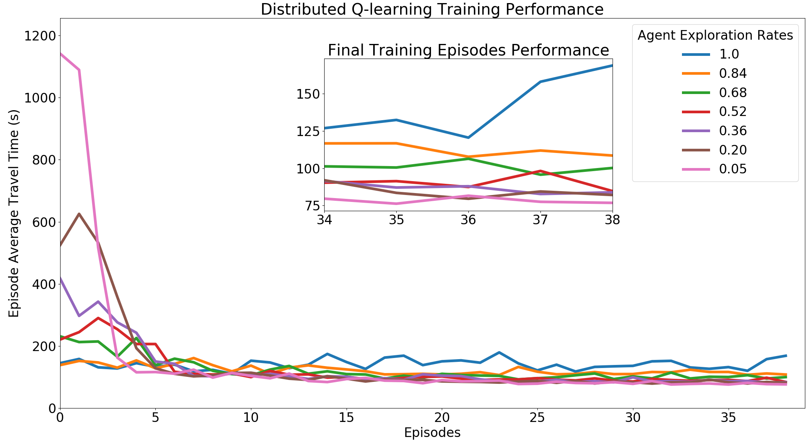

# deep-rl-tsc

## Distributed Deep Reinforcement Learning Traffic Signal Control

Distributed deep reinforcement learning traffic signal control framework for [SUMO](http://sumo.dlr.de/index.html) traffic simulation.

[YouTube Video Demo](https://youtu.be/Oyz2eHNmrak)

If you use this research, please include the following reference:

```
@article{doi:10.1080/15472450.2018.1491003,
author = {Wade Genders and Saiedeh Razavi},
title = {Asynchronous n-step Q-learning adaptive traffic signal control},
journal = {Journal of Intelligent Transportation Systems},
volume = {0},
number = {0},
pages = {1-13},
year  = {2019},
publisher = {Taylor & Francis},
doi = {10.1080/15472450.2018.1491003},
URL = {https://doi.org/10.1080/15472450.2018.1491003},
eprint = {https://doi.org/10.1080/15472450.2018.1491003}
}
```

## Installation

### Requirements

- [Python](https://www.python.org/) 3.6
- [Ubuntu](https://www.ubuntu.com/) 18
- [Sumo](https://sourceforge.net/projects/sumo/) 1.1.0
- [Tensorflow](https://www.tensorflow.org/) 1.12 (optimized builds [here](https://github.com/lakshayg/tensorflow-build))
- [SciPy](https://www.scipy.org/)
- [Keras](https://keras.io/) 2.2.4

## Running the code

### Training

```
python run.py -save -mode train
```

To learn more about all input arguments, run `python run.py --help`.

After training has completed, execute:

```
python graph_actors.py
```

to create a visualization of actors with different action explortation rates, similar to:



### Testing

```
python run.py -load -mode test
```


