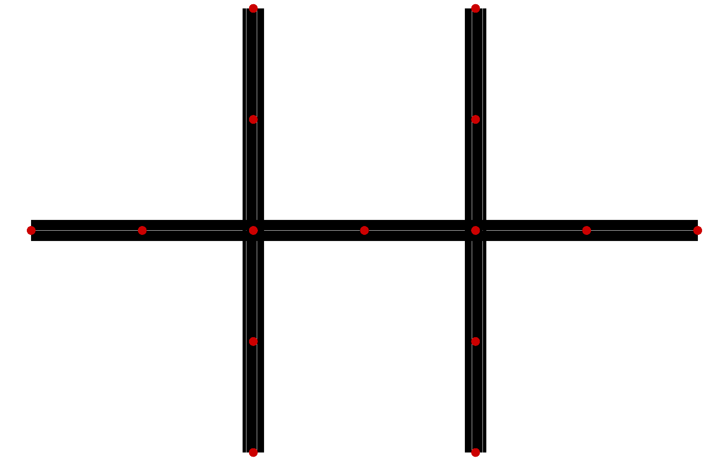

# deep-rl-tsc

## Distributed Deep Reinforcement Learning Traffic Signal Control

Distributed deep reinforcement learning traffic signal control framework for [SUMO](http://sumo.dlr.de/index.html) traffic simulation.

[YouTube Video Demo](https://youtu.be/Oyz2eHNmrak)

If you use this research, please include the following reference:

```
@article{doi:10.1080/15472450.2018.1491003,
author = {Wade Genders and Saiedeh Razavi},
title = {Asynchronous n-step Q-learning adaptive traffic signal control},
journal = {Journal of Intelligent Transportation Systems},
volume = {0},
number = {0},
pages = {1-13},
year  = {2019},
publisher = {Taylor & Francis},
doi = {10.1080/15472450.2018.1491003},
URL = {https://doi.org/10.1080/15472450.2018.1491003},
eprint = {https://doi.org/10.1080/15472450.2018.1491003}
}
```

## Installation

### Dependancies

- [Python](https://www.python.org/) 3.6
- [Ubuntu](https://www.ubuntu.com/) 18
- [Sumo](https://sourceforge.net/projects/sumo/) 1.1.0
- [Tensorflow](https://www.tensorflow.org/) 1.12 (optimized builds [here](https://github.com/lakshayg/tensorflow-build))
- [SciPy](https://www.scipy.org/)
- [Keras](https://keras.io/) 2.2.4

## Running the code

### Training

```
python run.py -nogui -save -mode train
```

To learn more about all input arguments, run `python run.py --help`.

After training has completed, execute:

```
python graph_actors.py
```

to create a visualization of actors with different action explortation rates, similar to:


When training, optimal execution requires balancing the number of parallel actors `-actor` and learners `-learner`. A simulation with a single intersection can be left at the default settings (i.e., 1 learner and the rest actors). As the number of signalised intersections in the network increases, more learners will be required. Agents are distributed to learners in an approximately equal fashion; each learner is responsible to perform batch updates for their assigned subset of agents (i.e., a network with 13 signalised intersections and 3 learners would allocate 4, 4 and 5 intersections to the learners). Each actor is assigned an epsilon greedy exploration policy from equal spaced intervals between a random policy and a defined greedy policy `-eps 0.05` (e.g., with 4 actors and `-eps 0.05`, the actors are implement one of (1.0, 0.68, 0.37, 0.05] epsilon greedy policies).

### Testing

To watch learned agents, execute:

```
python run.py -load -mode test -actor 1 -learner 1
```

## Overview

This framework takes a SUMO network simulation and develops deep reinforcement learning agents for each signalised intersection to act as optimal signal controllers. A [distributed actor/learner architecture](https://arxiv.org/abs/1803.00933) implemented with Python multiprocessing enables hardware scalability. This research implements [n-step Q-learning](https://arxiv.org/abs/1602.01783), an off-policy, valued based form of reinforcement learning. 


### Simulation

Two simple SUMO simulations are included, the first (`-netfp networks/single.net.xml -sumocfg networks/single.sumocfg`) with a single intersection:


and the second (default) with two intersections:



Vehicle generation is implemented in Vehicle.py class. Vehicles are generated uniform randomly over origin edges with their departure times into the network modelled as a Poisson process. SUMO subscriptions are used to optimize performance accessing vehicle data. Yellow and red phases inserted between conflicting green phases, their duration controlled by `-yellow 4 -red 4`.

### Reinforcement Learning

The n-step Q-learnig algorithm is used to train agents to implement acyclic, adaptive traffic signal control. An agent's policy selects the next green phase for a fixed duration. Green phases can be selected in an acyclic manner (i.e., no cycle). The fixed duration (i.e., action repeat) of the green phase is controlled with `-arepeat 15`. Smaller action repeats enable more frequent control but are likely more difficult to learn. The agent's state is a function of the density of all intersection incoming lanes. The reward is the negative cumulative delay of all vehicle on incoming lanes. The default deep neural network is a 2 hidden layer fully-connected architecture to model the action-value function, implemented in NeuralNetwork.py.

In `-mode train` the actors first execute until all experience replays are filled `-replay 10 000`. Then actors continue to generate trajectories until learners perform sufficient batch updates `-updates 10000`. In `-mode test` the actors execute 1 simulation. 


## Help

Consult the [SUMO Wiki](http://sumo.dlr.de/wiki/Simulation_of_Urban_MObility_-_Wiki) and [API docs](http://www.sumo.dlr.de/pydoc/traci.html) for additional help.
